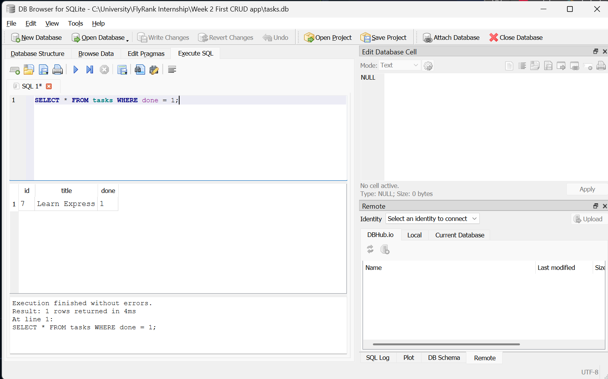
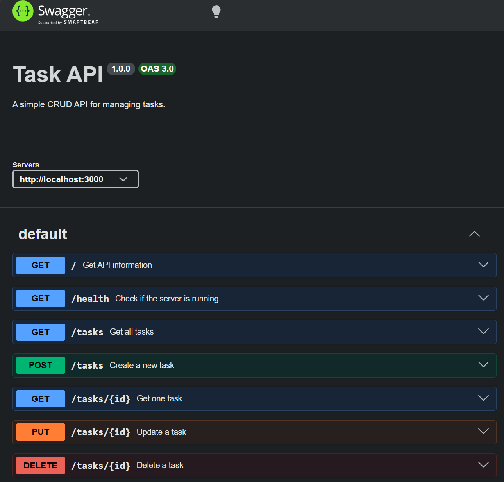

## PostgreSQL with Docker

For this stage, PostgreSQL runs inside a Docker container with a named volume so the database can persist between container restarts.

Start the Postgres container with:

```bash
docker run --name taskdb -e POSTGRES_PASSWORD=dev -e POSTGRES_DB=tasks -p 5432:5432 -v taskdata:/var/lib/postgresql/data -d postgres:17
```


Exploring SQLite

I opened `tasks.db` using DB Browser for SQLite and ran SQL queries directly against the tasks table.

```sql
SELECT * FROM tasks WHERE done = 1;
```




This is a CRUD API created with Node.js and express. It has a memory array that stores tasks and provides an endpoint to create, read, updaye, and delete the tasks. I included swagger ui so that the API can be tested.

Features: 
Create new tasks, View tasks, View specifjic tasks by ID, update tasks, delete tasks, Validates POST and PUT requests, Returns the correct status codes.

Installation

    Clone the repository:

    git clone https://github.com/Simply-Adam/First-CRUD-App.git

    Move into the project folder:

    cd First-CRUD-App

    Install the required packages:

    npm install
    Run the Server

    Start the API using:

    npm start

    The server runs at:

    http://localhost:3000

    Swagger UI is available at:

    http://localhost:3000/docs


Endpoints:


